# DaWeSys Technical Report

<!-- TODO: Inhaltsverzeichnis, wenn fertig. -->

## Tech Stack

- **Wer?** Oscar
- Grundlegende Entscheidungen ([Midterm slides] 5-8)
  - Android
  - Expo
  - React Native
  - Typescript
- warum? was macht die Technologie/ wie funktioniert sie? Unsere Erfahrung mit ihrer Anwendung
- Was für Privacy Conerncs gab es aufgrunddessen, dass es sich um eine Health Application handelt. Wie haben sich diese auf die Wahl von Technologien und oder Architektur der Applikation ausgewirkt. (Storage, Cloud, Backups,..)
- Apple Dev Account Problematik erklären
- Prettier / ESLint

### React Native und Expo

Unser Tech Stack orientiert sich maßgeblich an den geplanten Nutzer sowie der Ideologie von Kopfsachen. Usability und Accessibility steht daher an höchster Stelle. 
Da wir eine mobile App entwickeln heißt das konkret, wir wollen unsere App cross-platform für Android und iOS gleichzeitig mit einer Code-Base entwicklen.

Zunächst musste entschieden werden, mit welchem Framework wir entwicklen wollen. 
Dazu standen [React Native] und [Flutter] zur Debatte. 
Aus folgenden Gründen haben wir uns für React Native entschieden:

Große Community - Sollte es Fragen oder Hindernisse in der Entwicklung und Umsetzung geben, so existiert für React Native eine riesige, schon lange etablierte Community.

Mitgebrachte Erfahrung aus dem Team - Da einige von uns schon Erfahrungen mit React und JavaScript hatten konnten wir schnell in die Entwicklung mit React Native.

Vielzählige Libraries - Mit [NPM] als unser Package Manager stehen unserem Projekt damit mehr als [1100 Third Party Libraries](https://reactnative.directory) zur verfügung.

Nach ein wenig Recherche sind wir ebenfalls auf [Expo] gestoßen, was uns die Entwicklung auf viele arten in der Zukunft erleichtern würde. 
Expo ist eine Sammlung von Tools und Libraries, welche die schnelle Entwicklung in React Native unterstützt. 
Es vereinfacht den Build und Deploy Prozess immens was uns als agiles Scrum Team sehr entgegenkommt.

### TypeScript

Ein weiterer Bonus Punkt für React Native war die Unterstützung von [TypeScript]. 
Es ergänzt JavaScript um ein Statisches Typsystem. Damit erspart man sich Fehler, die daraus resultieren, dass JavaScript sonst dynamisch typisiert. 
Typen und Datentypfehler werden somit nicht erst zur Laufzeit geprüft und erkannt. Da nicht alle aus dem Team bereits Erfahrung mit JavaScript mitgebracht haben, hat uns TypeScript vermutlich einige Bugs und Flüchtigkeitsfehler erspart. 
Zudem Dokumentiert TypeScript unseren Code implizit weil strikte Typen gesetzt werden müssen. Code, der für sich selbst spricht, erspart dem Team oft unnötige Verwirrung und macht es Außenstehenden leichter den Code zu verstehen.

Initialisiert haben wir unser Projects mit der Expo CLI folgendermaßen:
```shell
npm i -g expo-cli
npx create-react-native-app -t with-typescript
```

Der `-t` Flag stellt viele Templates für die Initialisierung eines React Native Projekts zur Verfügung. Wir haben uns für das Default TypeScript Template entschieden.

### ESLint und Prettier

Im oberen Abschnitt hatten wir angesprochen, dass TypeScript uns bei der Lesbarkeit und Fehlerverbeugung im Code geholfen hat. 
[ESLint] bringt ähnliche Vorteile, indem es den Code analysiert um Probleme oder Schwachstellen zu erkennen während man ihn schreibt, ohne ihn ausführen zu müssen.

[Prettier] haben wir in unser Projekt integriert um unseren Source Code einheitlich zu Formatieren. Obwohl es zwar nett ist, dass jeder seinen eigenen Coding Stil hat, ist es nicht schlecht gewisse Konventionen und Standards im Team einzuhalten. 
Mit Prettier haben wir uns hier bspw. auf einheitliche Namens Konventionen einigen und im gesamten Projekt geltend machen. 

ESLint und Prettier zusammen ersparten uns damit außerdem Zeit im Review was in der agilen Entwicklung natürlich immer willkommen ist.


### Apple Developer Program

Für die agile Entwicklung war es uns wichtig schnell Prototypen kreieren zu können. Diese sollten dann auch leicht teilbar bzw. testbar sein.
Aus unserem React Native Projekt eine auf Android Geräte nutzbare `.apk` zu erstellen ist recht unkompliziert. Diese kann einfach signiert und gebaut werden. Das Resultat ist eine `.apk` welche verteilt und bspw. auf dem Android Emulator getestet werden kann.

Bei iOS ist es leider nicht so simpel. Um unsere App während der Entwicklung für iOS Geräte zu testen, muss eine `.ipa` gebaut werden. Diese kann dann bspw. im Review heruntergeladen und installiert werden. 
Um dies zu tun muss die App im Build Prozess jedoch mit einem registrierten [Apple Developer Account] signiert werden. Die Lizenz dazu kann entweder als Einzelperson für 99€ erworben oder als Bildungseinrichtung kostenlos beantragt werden. Mehr Infos dazu [hier](https://developer.apple.com/programs/enroll/).

Da wir wussten, es würde vermutlich eine Weile dauern um eine Apple Developer Lizenz zu beantragen, mussten wir uns überlegen wie wir trotzdem zeitnah in die iOS Entwicklung einsteigen können. Hier stießen wir die auf Option den iOS Simulator zu nutzen. 
Auf diesem von Apple zur verfügung gestellten Simulator ist es möglich Builds in form einer .app zu installieren. Diese sind im Grunde ein Subset der `.ipa`, welche bestimmte Dateien nicht enthält, die für die Installation auf einem iOS Gerät notwendig sind. 
Das gute an dem `.app` Build ist, dass sie keinen Apple Developer Account voraussetzt.

Weil bei Apple aber nichts zu einfach sein darf, gibt es aber auch hier einen Hacken. Beides, `.ipa` und `.app` können nur mit [Xcode] gebaut werden. Xcode existiert jedoch nur auf macOS. 
Da in unserem Team neben macOS auch Windows und Linux als bevorzugte Betriebssystem existieren kann nicht jeder im Team eine `.app` bauen. Hier hat uns erneut Expo weiterhelfen können.

Expo bietet uns neben dem Feature unsere App lokal zu bauen auch die Möglichkeit das Bauen komplett auf Serverseite zu erledigen. Dazu wird einfach ein Bundle aus dem Source Code erstellt welches auf Expo Server hochgeladen wird. 
Hier wird je nach Einstellung, eine von Expo signierte `.apk` oder `.app` gebaut. Nach etwa 6 Minuten können diese dann einfach heruntergeladen werden. 
Somit konnte das gesamte Team unabhängig vom Betriebssystem Prototypen für Android und den iOS Simulator erstellen.

Eine Apple Developer Lizenz zu beantragen verlief leider erfolglos. Die erste Option, die Lizenz als Bildungseinrichtung zu beantragen war nicht möglich, da nur die TU Berlin als gesamte Institution solche Lizenzen beantragen kann. 
Das ist der [ZECM] leider nicht möglich. Die zweite Option, die Lizenz als Einzelperson zu finanzieren war ebenfalls nicht möglich, da wir Apple als eine juristische Person auftreten müssten. Abgesehen davon würde dies wohl etwas 8 Wochen in Anspruch nehmen. 
Daher war es uns leider nie möglich unsere App als `.ipa` auf einem realen iPhone oder iPad zu testen.

## ~~Organisation / Agile Entwicklung (GH Projekte) - (Nochmal Elias fragen ob das in den Report gehört - tut es nicht)~~

## Continuous Integration / Continuous Delivery

Um unsere Zusammenarbeit in unserem Git-Repository zu organisieren und effektiv parallel an derselben Codebasis zu arbeiten, haben wir uns am weit verbreiteten [Git Flow] Workflow orientiert.
Dabei beginnen wir die Arbeit an einem Feature (oder einer anderen geplanten Änderung), indem wir einen neuen Feature-Branch auf Basis von develop erstellen.
Nach Fertigstellung des Features wird ein Pull Request erstellt.
Darauf reviewen andere Mitglieder der Gruppe die Änderungen, die dann in den develop-Branch zurück gemergt werden.
Dadurch enthält der develop-Branch immer alle fertigen Features.

Dieser Prozess hat so aber noch zwei Nachteile:
* Reviewer müssen PRs selbst auschecken und lokal bauen, um sie zu testen. Das schließt auch aus, dass nicht-Entwickler:innen Änderungen reviewen.
* Es ist nicht garantiert, dass die Features, die zuvor einzeln auf ihren Branches funktioniert haben, auch korrekt zusammenspielen, nachdem sie in develop gemergt sind.

Um diese Punkte zu lösen, haben wir einen CI-Workflow entwickelt. 
Dafür haben wir [GitHub Actions] verwendet, da wir bereits GitHub benutzen und Actions für öffentliche Repositories unbegrenzt kostenlos ist.
Der Workflow hat mehrere Jobs, die bei jedem Push auf bestimmte Branches laufen:

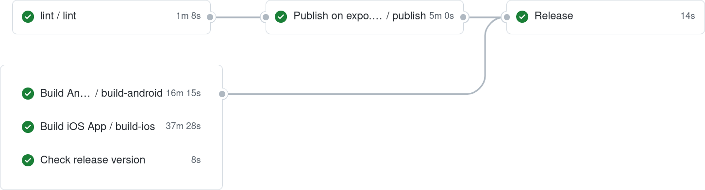

### Publish

React Native Apps bestehen aus einem nativen Teil, der plattformabhängig ist, und einem JavaScript-Teil.
Der native Teil ändert sich nur, wenn auch native Komponenten geändert werden, was sich auf ein Minimum beschränken sollte.
Immerhin verwendet man React Native, um die App in JavaScript zu schreiben und Plattform-Spezifika wegzuabstrahieren.
Deshalb bietet Expo ein Feature, um den JavaScript-Teil separat vom nativen Teil zu aktualisieren.
Dieses Feature bringt auch die Möglichkeit, den JavaScript-Teil gar nicht in der eigenen nativen Hülle auszuführen, sondern in der "Expo Go" app.


In unserer CI benutzen wir eben dieses Feature, um den Review-Prozess zu erleichtern.
<small>("EAS Updates" hat in der neuen Expo SDK v46 das alte "Expo Publish" ersetzt, beide funktionieren allerdings sehr ähnlich.)</small>
Nach dem Hochladen des JavaScript-Bundles mit dem Befehl `eas update --auto` kann ein Link zu einem QR-Code erstellt werden, der mit der Expo Go app gescannt werden kann, um den aktuellen Stand des Branches zu öffnen.
Der rechte QR-Code verweist auf den aktuellen Stand des develop-Branches.
Bei Pull Requests wird der QR-Code in einem Kommentar hinzugefügt und kann von dort gescannt werden.

### Android/iOS Build

Der JavaScript-Teil einer einmal installierten App kann zwar mithilfe von EAS updates automatisch aktualisiert werden, jedoch ist für die Installation selbst und für native Änderungen ein App-Paket nötig.
Im Falle von Android bauen wir eine APK, die auf einem echten Gerät oder dem Android Emulator installiert werden kann. 
Bei iOS wäre das Pendant dazu eine IPA.
Aufgrund dessen, dass wir, wie bereits erwähnt, keine Apple Developer Lizenz haben, können wir aber leider nur einen `.app`-Ordner bauen, der nur im iOS-Emulator ausgeführt werden kann.

### Linting

Auch ESLint führen wir in der CI bei jedem Push aus.
Warnungen und Fehler sind dann mithilfe der GitHub Action [eslint-annotate-action] direkt als sogenannte Annotations in GitHub an den betroffenen Code-Zeilen sichtbar.
Das hilft uns dabei, Code Smells und mögliche Fehlerquellen schnell zu erkennen und einen konsistenten Code-Style beizubehalten.

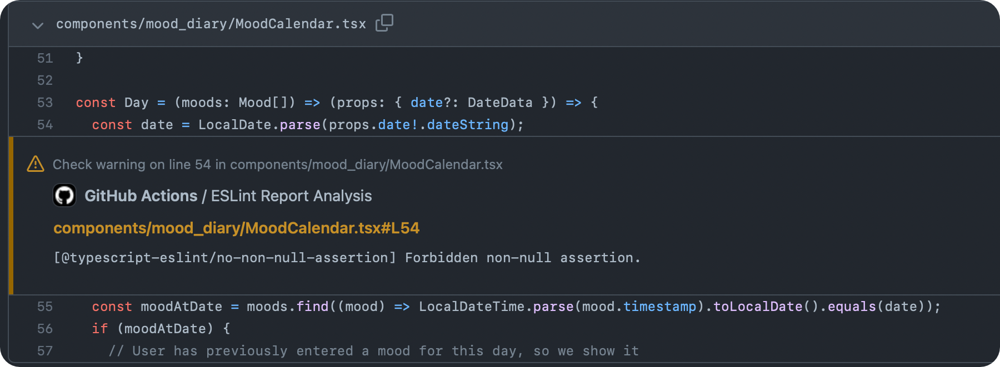

### Release / CD 

Zwar wäre es auch möglich den Stand des develop-Branches zu bestimmten Zeitpunkten zu Google Play bzw. zum Apple Store hochzuladen, jedoch hat Git Flow auch hier einen besseren Prozess:
Will das Team vom Stand des develop-Branches ein Release erstellen, wird ein Release-Branch namens `release/x.y.z` erstellt, wobei `x.y.z` die Versionsnummer der neuen Version ist.
Auf diesem Branch wird dann die Version in der `package.json` angehoben und die App wird getestet.
Nach etwaigen Nachbesserungen wird dieser Branch dann sowohl in den main-Branch als auch in den develop-Branch gemergt.
Auf dem main-Branch wird dieser Stand dann mit dem Tag `vx.y.z` versehen, um das Release fest zu markieren.

Auch diesen Prozess haben wir mithilfe von GitHub Actions teilweise automatisiert:
Zum Erstellen des Release-Branches und Anheben der Versionsnummer startet man den Workflow `release-start`, und zum mergen in main und develop und taggen den `release-finish` Workflow.

Nachdem der `release-finish`-Workflow das Release in den main-Branch gemergt und getaggt hat, läuft dort neben den bereits erwähnten CI-Jobs auch der Release-Job, der die APK und `.app` in einem GitHub-Release publiziert.
An dieser Stelle soll die neue Version der App zukünftig Mal automatisch zu Google Play und zum Apple Store eingereicht werden, um echte Continuous Delivery (CD) zu schaffen.

### Testing

Zu einer guten modernen CI/CD-Pipeline gehören auch verschiedene Formen von Testautomatisierung.
Leider war die Zeit des Praktikums nicht ausreichend, um sowohl einen Großteil des geplanten Feature-Sets als auch eine zufriedenstellende Testabdeckung herzustellen, und wir haben uns für ersteres entschieden.
Es gibt einen aktuell noch nicht gemergten Pull Request (ProgPrak-Native-App/react-native-app#76) mit Jest Unit-Test-Konfiguration und einem Proof-of-Concept [Snapshot Test](https://jestjs.io/docs/snapshot-testing).

Außerdem haben wir versucht, End-to-End Tests mithilfe des Frameworks Appium zu schreiben, jedoch erwies sich Appium als unzuverlässig. 
Es war uns nicht möglich, funktionierende Tests zu schreiben, bevor wir abbrechen mussten, um uns auf wichtigere Aufgaben zu konzentrieren. (ProgPrak-Native-App/react-native-app#73)

Beide dieser Ansätze sollten noch einmal aufgegriffen werden, falls die App weiterentwickelt wird.
Für E2E-Testing gibt es ein besser auf React Native angepasstes Framework namens [Detox](https://github.com/wix/detox), das allerdings Probleme bei der Integration mit Expo verspricht.

[Git Flow]: https://nvie.com/posts/a-successful-git-branching-model
[eslint-annotate-action]: https://github.com/ataylorme/eslint-annotate-action
[GitHub Actions]: https://github.com/features/actions

## Design

Eine weitere Herausforderung war es, das von Kopfsachen vorgegeben Design nach Standards der Benutzerfreundlichkeit (_Usability_) anzupassen, sowie dieses barrierefrei (_Accessibility_) zu gestalten.

Zur Beurteilung, ob etwas benutzerfreundlich ist, wurde sich an der DIN EN ISO 9241-11 [3], orientiert.

Diese beinhaltet, unter anderem, die Definition, dass Benutzerfreundlichkeit bzzw. _Gebrauchstauglichkeit_ sich aus Effektivität, Effizienz und Zufriedenstellung der Interaktion des Nutzenden mit dem Nutzungsgegenstand, hier der App, zusammensetzt.

Im Falle von Kopfsachen bedeutete dies, dass Aufgaben schnell und eindeutig lösbar sind, ohne dass die Anwendender:innen hinterher frustriert sind.

Schwierig war dabei die Menge an schriftlichen Informationen, die dargestellt werden sollten, benutzerfreundlich zu formatieren und zugleich an die relativ kleinen Bildschirme von mobilen Endgeräten anzupassen.

In den nachfolgenden Grafiken wird am Beispiel der Sozialen Unterstützung eine benutzerfreundliche Umgestaltung skizziert.

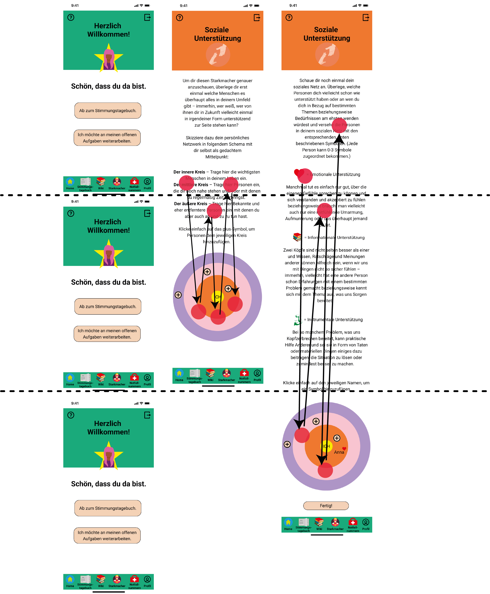

_Die sich in der Grafik befinden roten Punkte symbolisieren hier jeweils eine Touch- und die Pfeile eine Scroll-Interaktion durch eine:n Nutzer:in._

Schnell ist zu erkennen, dass wichtige Informationen die für das Bearbeiten der Aufgabe relevant sind, sich weit weg von den zu bearbeitenden Elementen (_Kreise_) befinden.

Die User:innen sind somit gezwungen, ständig zwischen relevanten Informationen und den zu bearbeitenden Elementen hin und her zu scrollen.

Dies erscheint weder effizient noch ist das ständige Hin-und-Her sonderlich zufriedenstellend. Das könnte demnach zu erhöhter Frustration der Nutzer:innen führen, welche potenziell mit der Länge des Bildschirms zunehmen könnte.

Ein Lösungsansatz war es, die Informationen in mehrere Bildschirme einzuteilen, sodass die Aufgabe Schritt für Schritt bearbeitet werden kann. Ohne das zwischen Aktivitäten wie scrollen, lesen, bearbeiten, gewechselt werden muss.

Bei der Unterteilung wurde sich an das Designprinzipen _Gestalt der Ähnlichkeit_ (Gruppierung ähnlicher Inhalte) gehalten, sowie die Informationen gemäß ihrer Priorität sortiert.

Somit konnten den Nutzender:innen die wichtigsten Informationen geordnet zuerst präsentiert werden, sodass die Aufgabe, effektiv, effizient sowie zufriedenstellen lösbar ist.

<p>
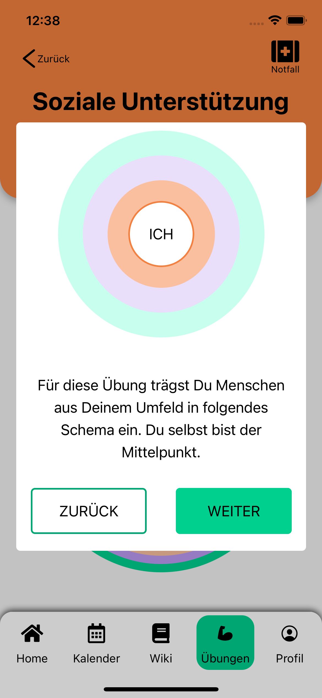
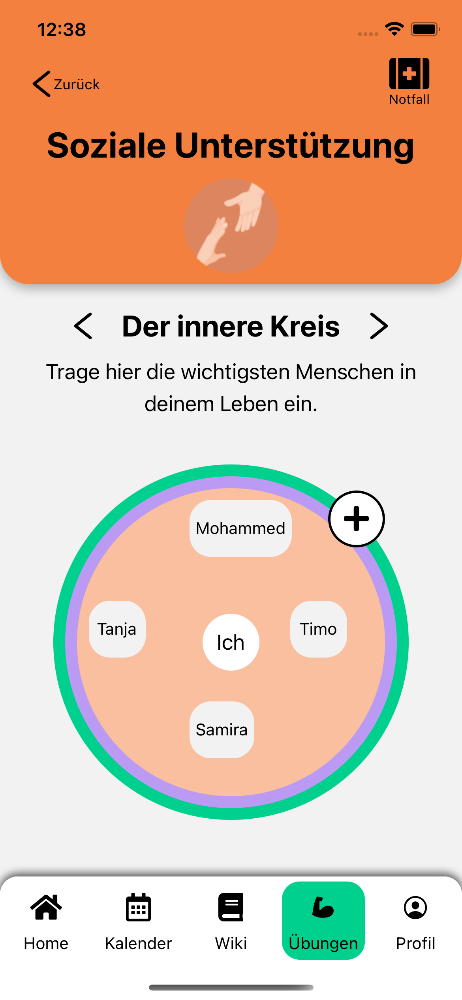
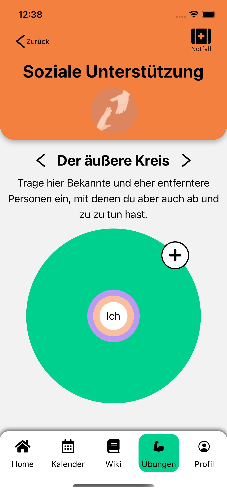
</p>

Eine weitere benutzerfreundliche Umgestaltung spiegelt sich im Wiki wider. Hier war die Herausforderung, das Design für mobiles Lesen zu optimieren.

Wie aus [_How People Read Online: New and Old Findings_](https://www.nngroup.com/articles/how-people-read-online/) hervorgeht, lesen Anwendender:innen Artikel nicht von Anfang bis zum Ende, sondern scannen schriftliche Inhalte nach Informationen, die für sie gerade relevant sind und lesen erst dann Wort für Wort.
Um dieses Verhalten zu unterstützen, erfolgte eine Optimierung des Layouts, sodass Artikel in Unterschriften grob zusammengefasst wurden und diese bei Bedarf ausklappbar sind.

Die Umsetzung erfolgte mithilfe von Markdown Dateien, welche im Backend hinterlegt sind und im Frontend entsprechend geparst werden.

Des Weiteren wurde sich dafür entschieden, das Design für eine möglichst barrierefreie Nutzung zu optimieren. Hierfür wurden die Richtlinien der [WCAG](https://www.w3.org/WAI/standards-guidelines/wcag/) sowie von [Matarial.io](https://material.io/design/usability/accessibility.html), da dies primär eine für Android entwickelte App ist, umgesetzt. Diese Standards beinhalteten unter anderem Vorgaben für Farbkontraste, Abstände, Größen und Beschriftungen.

In der nachfolgenden Grafiken kann die Umsetzung dieser Richtlinien nachvollzogen werden.

<p>
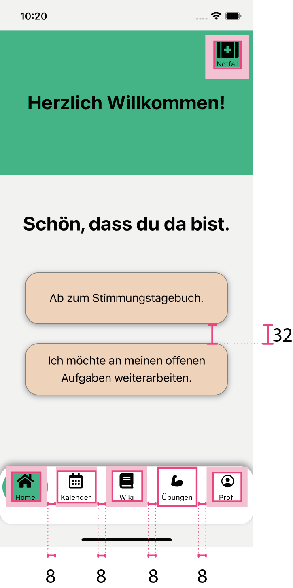
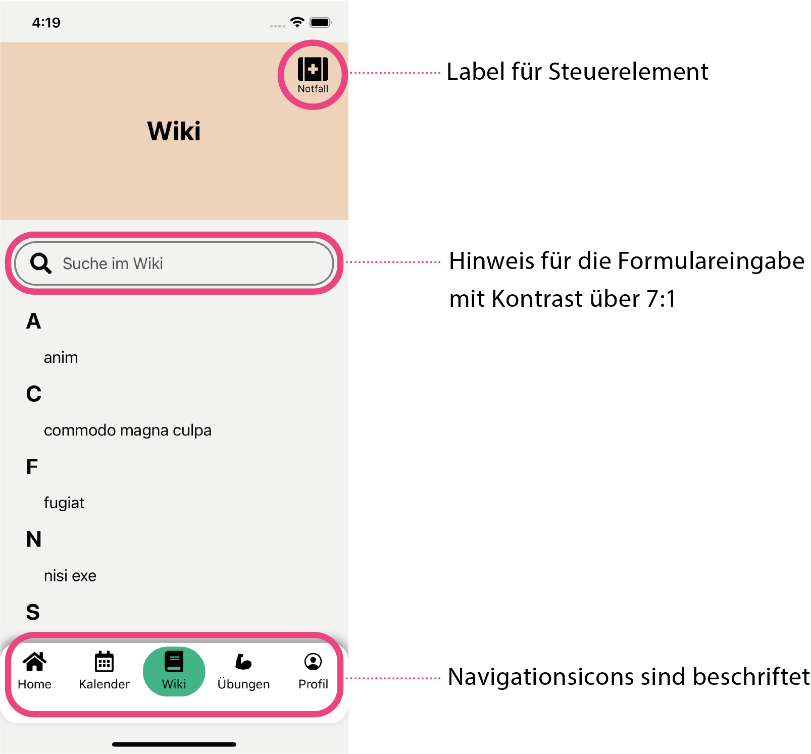
</p>

Für die Entwicklung wurden diese Vorgaben als globale Konstanten angelegt, sodass diese
immer schnell zur Hand waren.

Des weiteren wurden den Steuerelemente ein Accessibility Label hinzugefügt. Dies wird von einer VoiceOver Steuerung vorgelesen, sollten die User:innen diese benutzen.

Aufgrund dessen, dass die Nutzung aus den Accessibility Labels eventuell nicht aussagekräftig genug sein könnte, wurden den meisten Elementen noch ein Accessibility Hint hinzugefügt.
Dieser kann dazu genutzt werden ausführlich zu erklären was passiert, wenn User:innen mit diesem Element interagieren.

[3]: DIN e.V. (Hrsg.) DIN EN ISO 9241-11:2018-11, 2018, Kap. 6.1

## Authentifizierung

**Wer?** Ludwig

Bei der Implementierung der Authentifizierung musste sowohl auf die Vorgaben des Auftraggebers Kopfsachen, als auch auf die Spezifikation des Backends Rücksicht genommen werden.

Kopfsachen wünscht sich eine einmalige Einleitung in die App. Einleitend wird der User bei der erstmaligen Öffnung der App auf einem Willkommens Bildschirm landen. Hier wird der User durch eine Erklärung in den allgemeinen Nutzen und die Funktionen der App eingeführt.

Wenn sich der User weiter durch die Einleitung klickt, landet er auf einer weiteren Seite, auf welcher er schließlich durch einen einfachen Klick auf den „Weiter“ Button einen neuen Account anlegt. Ebenfalls hat er hier die Option mit Hilfe eines QR Codes einen bereits vorhanden Account auf dieses Gerät zu übertragen. Nach dem Klicken des Buttons soll der User auf dem Home Screen der App landen. Dieser wird nun bei jeder neuen Öffnung der App angezeigt.

Das Backend gibt nach dem abgeschlossenen Authentifizierung-API-Flow einen accountKey zurück, welcher dem User eindeutig zugeordnet ist.

### React Context:

Um den accountKey in verschiedenen Bereichen der App benutzen zu können, wurde bei der Implementierung React Context benutzt. React Context ermöglicht es Daten innerhalb der App in verschiedenen Komponenten zu benutzen, ohne diese über Props von Komponente zu Komponente explizit zu übertragen. Ein Vorteil davon ist, dass accountKey nur in den Komponenten benutzt wird, die dafür auch vorgesehen sind.

Um dies umzusetzen wurde eine Komponente UserProvider erstellt, die den Rest der App auf höchster Ebene „verpackt“. Über die Funktion useUserContext kann schließlich innerhalb jeder Komponente innerhalb des UserProvider auf den accountKey zugegriffen werden.

Ebenfalls ist React Context nützlich, um die von Kopfsachen gewünschte Einleitung umzusetzen. So kann die von React zur Verfügung gestellte Funktion UseCallback innerhalb der selbst geschriebenen addUser Funktion des UserProviders benutzt werden, sodass sich die App automatisch neu lädt sobald der accountKey neu angelegt wird.

In der Komponente AppWrapper wird der Context benutzt um das bedingte Anzeigen der Einleitung, oder des Home Bildschirms zu realisieren. Wenn diese Komponente neu geladen wird, landet der User also bei gesetzten accountKey auf dem Home Bildschirm und bei nicht gesetzten accountKey auf dem Willkommens Bildschirm.

Mit Hilfe der Funktion useEffect von React wird bei unserer Implementierung der localStore (umgesetzt mit SecureStore von Expo) automatisch erneuert, wenn sich der accountKey ändert, sodass der accountKey im globalen Kontext persistiert wird.

### Authentifizierung-API-Flow:

Der API-Flow für die Authentifizierung läuft folgendermaßen ab:

Nachdem der Button „Weiter“ am Ende der Einleitung geklickt wurde, wird eine GET Anfrage an den Endpoint self-service/registration/api geschickt.

Aus der Response wird die URL für die nächster POST Anfrage ausgelesen. Daraufhin wird die POST Anfrage geschickt, aus deren Antwort der accountKey des Users beschafft wird. Schließlich wird der accountKey mit der Funktion setAccountKey im State des UserProviders aktualisiert.

Es wurde ein Authentication Client geschrieben und verwendet, welcher vom allgemeinen Base Client erbt. Dieser setzt die URL zusammen, die für den API Call gebraucht wird und stellt asynchrone Funktionen bereit, die den Ablauf der Registration, oder des Logins abwickeln.

## Derselbe Account auf mehreren Geräten

Bei traditionellen Auth-Konzepten mit Benutzername oder E-Mail und Password kann Nutzer:innen zugemutet werden, sich ihre selbst gewählten Zugangsdaten selbst zu merken oder zu sichern, und sie auf neuen Geräten einfach wieder einzugeben. Bei dem bereits beschriebenen Auth-Konzept des Mindtastic-Backends entfallen solche selbstgewählten Pseudonyme und Passwörter jedoch zugunsten eines zufällig generierten, 36-stelligen Codes, dem "Account Key". Hier wären das Abschreiben oder gar das Merken sowie die manuelle Eingabe ein schreckliches Nutzerinnenerlebnis.

Trotzdem halten wir es jedoch für unabdingbar, dass Nutzer:innen das gleiche Profil auf mehreren Geräten nutzen können. Deshalb bedarf es einer Methode, den Account Key auf einen anderen Client zu übertragen. Da wir eine mobile App entwickeln, können wir hier Gebrauch von der Kamera machen. Inspiriert von Anwendungen wie Whatsapp Web, Telegram Web oder 2FA-Apps haben wir uns für einen QR-Code entschieden.

### Implementierung

Die Implementierung dieses Features bestand aus zwei Teilen:

- Ein neuer Screen soll den Account Key in einem QR-Code kodieren und anzeigen.
- Als Alternative zur erneuten Registrierung soll beim ersten Start (oder nach Löschung des Profils) die Möglichkeit gegeben werden, einen QR-Code scanner zu öffnen. Nach Einscannen eines korrekten QR-Codes soll sich mit dem darin enthaltenen Account Key eingeloggt werden.

#### Anzeigen des QR-Codes

Zwar gibt es Out-of-the-Box QR-Code Komponenten für React Native [[1], [2]], jedoch sind diese etwas einschränkend in ihren Möglichkeiten. Da es mit nur minimalem Mehraufwand möglich ist, mithilfe einer universellen QR-Code-Library wie [node-qrcode]
SVG-Quelltext zu erzeugen und diesen mithilfe von [react-native-svg] anzuzeigen, haben wir uns für diesen Weg entschieden.

Da sich um uns herum heutzutage viele QR-Codes befinden, die wir beim späteren scannen nicht versehentlich als Account Keys unserer App fehlinterpretieren wollen, formatieren wir ihn als URI der Form `kopfsachen:account/6aa5f1b7-fe69-4cb8-a8b0-f50089888a3f`.

```tsx
QRCode.toString(`kopfsachen:account/${accountKey}`).then(setQrCodeXml);
// ...
return <SvgXml xml={qrCodeXml} />;
```

### Scannen des-QR Codes

Expo stellt die Library [expo-barcode-scanner] bereit, die neben Barcodes und einer Reihe anderer Formate auch QR-Codes lesen kann. Dabei kann die Kameravorschau einfach als React-Komponente eingebunden werden. Wird ein Code jedweder Art erkannt, wird ein Callback aufgerufen.

```tsx
export const ACCOUNT_QR_CODE_PREFIX = "kopfsachen:account/";

const handleBarCodeScanned: BarCodeScannedCallback = ({ type, data }) => {
  if (type !== BarCodeScanner.Constants.BarCodeType.qr) {
    console.debug("Scanned something other than a qr code, ignoring");
    return;
  } else if (!data.startsWith(ACCOUNT_QR_CODE_PREFIX)) {
    console.debug(
      `QR code data does not start with '${ACCOUNT_QR_CODE_PREFIX}', ignoring`
    );
    return;
  }

  const accountKey = data.substring(ACCOUNT_QR_CODE_PREFIX.length);
  if (accountKey.length !== 36) {
    console.debug(
      `QR code does not contain a valid account key after '${ACCOUNT_QR_CODE_PREFIX}', ignoring`
    );
    return;
  }

  setAccountKey(accountKey);
};

return (
  <BarCodeScanner
    barCodeTypes={[BarCodeScanner.Constants.BarCodeType.qr]}
    onBarCodeScanned={handleBarCodeScanned}
    style={StyleSheet.absoluteFill}
  />
);
```

Leider erwies sich die BarCodeScanner-Komponente beim Styling des Screens als Problemquelle. Es muss eine Höhe und Breite angegeben werden, in die die Kameravorschau dann so groß wie möglich mit dem korrekten Seitenverhältnis eingesetzt wird. Da die Library aber die Größe der Kameravorschau nicht verfügbar macht, bleiben je nach Gerät immer oben und unten schwarze Ränder, die nicht entfernbar sind. Der Screen ist vermutlich auf allen Geräten nutzbar, sieht aber vermutlich auf einigen (möglicherweise Tablets) nicht gut aus.

### Weiterentwicklung

Um aus diesem Feature den besten Nutzen zu schlagen, sollten auch in die Webanwendungen eine Funktion zum Anzeigen eines QR-Codes mit dem gleichen Format erhalten. Möglicherweise könnten diese auch angeschlossene Kameras nutzen, um einen QR-Code-Scanner zu implementieren.

Außerdem sollte, für den Fall, dass die Kamera des genutzten Smartphones kaputt ist oder anderweitig nicht genutzt werden kann, die Option zur manuellen Eingabe des Account Keys gegeben werden. Dazu haben wir bereits einen Knopf hinzugefügt, der aber noch keine Funktion hat.

<p>
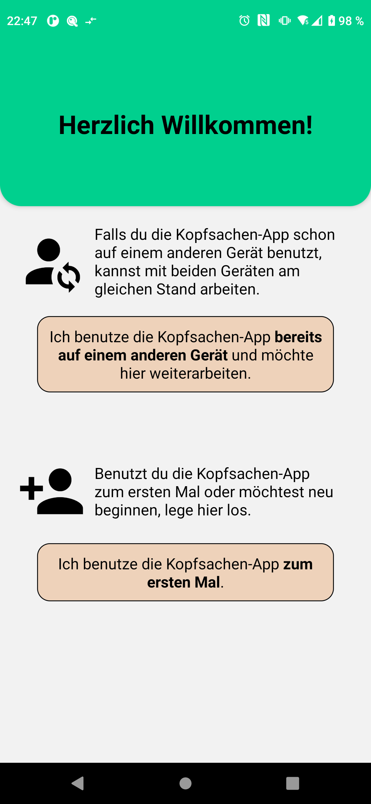
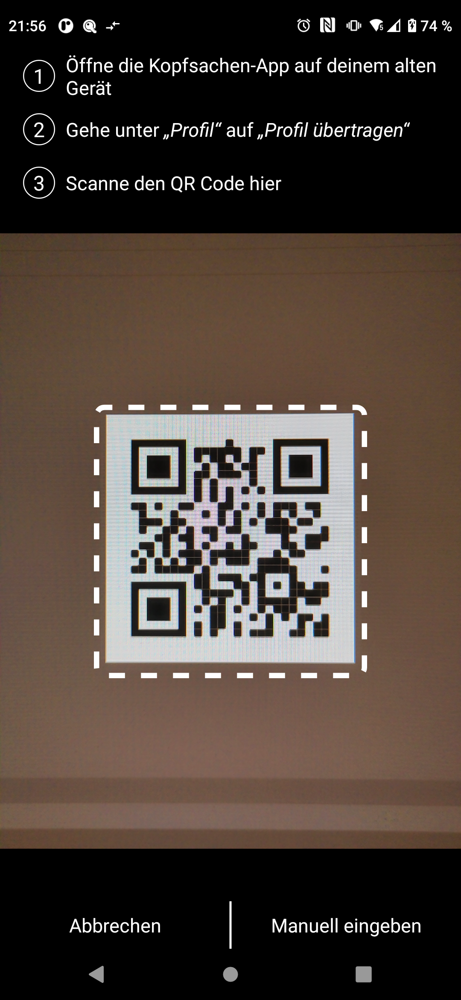

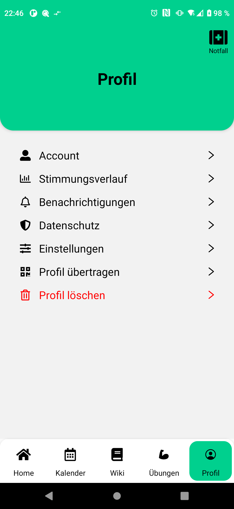
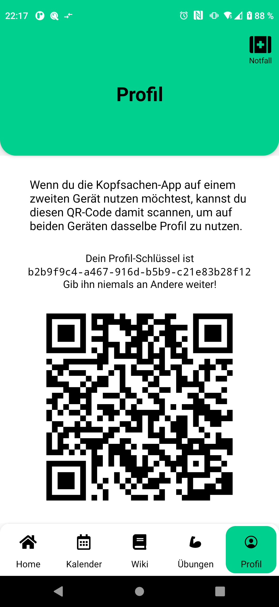
</p>

[1]: https://www.npmjs.com/package/react-native-qrcode
[2]: https://www.npmjs.com/package/react-native-qrcode-svg
[node-qrcode]: https://www.npmjs.com/package/qrcode
[react-native-svg]: https://docs.expo.dev/versions/latest/sdk/svg/
[expo-barcode-scanner]: (https://docs.expo.dev/versions/latest/sdk/bar-code-scanner/)

## Sicherheitsnetz

Ein großer Teil der Kopfsachen-App besteht aus den von Kopfsachen vorgegebenen Starkmachern. Diese erlauben es den Nutzer:innen auf verschiedenen Wegen Probleme mit mentaler Gesundheit zu bewältigen bzw. vorzubeugen.

Ein besonders wichtiger Starkmacher ist das Sicherheitsnetz. Dort tragen die Nutzer:innen Themen, Personen, Aktivitäten etc. ein, die sich im tagtäglichen Leben positiv auf die mentale Gesundheit auswirken oder die im schlimmsten Fall ein "Auffangnetz" bilden.

### Sicherheitsnetzeinträge im Frontend

Zunächst wurde der Datentyp "SafetyDType" definiert, welcher die eingetragenen Daten der Nutzer:innen durch den Erstellungsprozess eines Sicherheitsnetzeintrags trägt.
SafetyNetDType besteht aus vier Teilen:

```tsx
export type SafetyNetDType = {
  id: number;
  type: string;
  name: string;
  strategies: [string, string, string];
};
```

1.  "id" ist eine im Backend generierte Nummer, die den Eintrag eindeutig identifiziert
2.  "type" ist der von Nutzer:innen eingetragene Typ des Eintrags
3.  "name" ist ist der von Nutzer:innen eingetragene Titel des Eintrags
4.  "strategies" ist ein Array aus drei Strings, von denen mindestens einer ein nicht-leerer string sein muss

### Verwendung des Sicherheitsnetzes

Die Erstellung eines Sicherheitsnetzeintrages in der App besteht aus zwei Schritten.

Im ersten Schritt tragen die Nutzer:innen einen Titel ein und wählt eine, von fünf möglichen, Kategorien für den Sicherheitsnetzeintrag.
Der eingetragene Titel wird unter "name" gespeichert und das ausgewählte Icon bestimmt den "type" (z.B. Pfotenicon -> "type": "pets"). Nach Bestätigung wird überprüft ob ein "name" und "type" angegeben wurden und an den zweiten Schritt weitergeleitet.

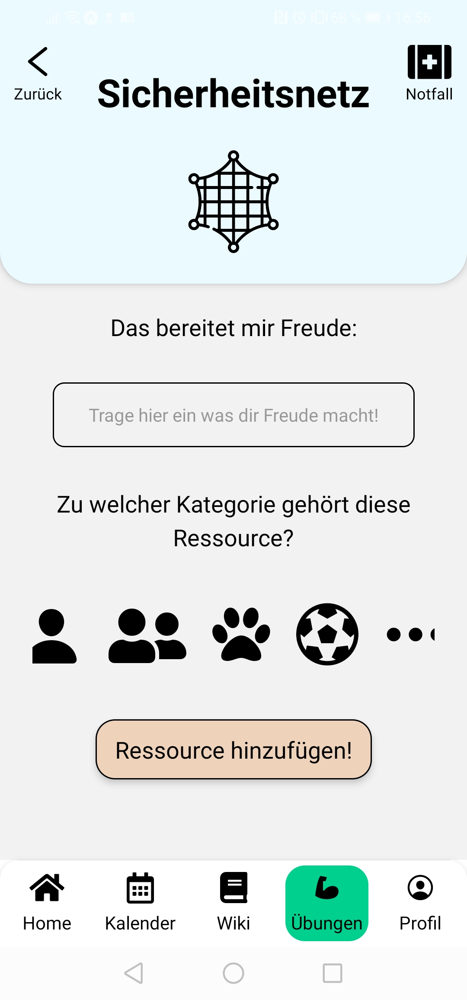

Im zweiten Schritt tragen die Nutzer:innen mindestens eine und maximal drei Strategien ein, wie dieser Sicherheitsnetzeintrag helfen kann. Diese werden unter "strategies" gespeichert. Hier wird auch überprüft ob am Ende genug Daten (mindestens eine eingetragene Strategie) vorliegt.

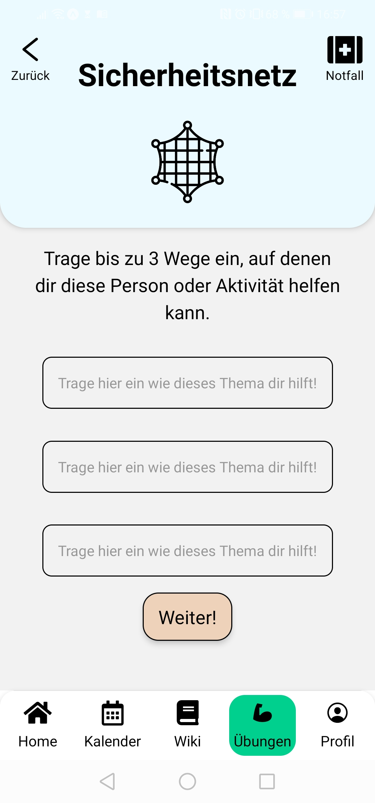

Nach Bestätigung des zweiten Schrittes werden die Daten aus dem SafetyNetDType per POST-Request an das Backend versendet.

### Kommunikation mit dem Backend

Um Schreibarbeit zu sparen und die Kommunikation mit dem Backend in einem zentralen Punkt zu halten, wurde die "AuthenticatedBaseClient" Klasse erstellt. Diese enthält Archetypen für verschiedene Arten von Anfragen (POST, GET, etc.), welche per fetch-API,mit der Session-ID im Header, an das Backend versendet werden.

```tsx
export default class BaseClient {
  constructor(protected baseUrl: URL | string) {}

  protected async request(
    method: string,
    path: string,
    options?: RequestInit
  ): Promise<Response> {
    const url = path.includes("://")
      ? path // absolute
      : new URL(path, this.baseUrl);

    const response = await fetch(url, {
      method,
      ...options,
    });

    if (response.ok) {
      return response;
    } else {
      throw new Error(`${response.statusText}. Error code ${response.status}.`);
    }
  }

  protected async get<R>(path: string, options?: RequestInit): Promise<R> {
    const response = await this.request("GET", path, options);
    return await response.json();
  }

  //...
}
```

Zur Nutzung des AuthenticatedBaseClients in einem Feature, wird beispielsweise für das Sicherheitsnetz, eine Klasse "SecurityNetClient" erstellt, welche vom AuthenticatedBaseClient erbt.
Dort werden die Daten aus dem Frontend und die gewollten Endpunkte (z.B. "/safetyNet" oder "/safetyNet/3") and die Anfragen gebunden.
Außerdem können mögliche Netzwerkfehler oder unerfolgreiche Anfragen abgefangen werden und Fehlermeldungen ausgegeben werden.

```tsx
export default class SecurityNetClient extends AuthenticatedBaseClient {
  public async getItems(): Promise<SafetyNetDType[]> {
    const result = await this.get<SafetyNetDType[]>("/safetyNet").catch(() => {
      Alert.alert(
        "Keine Verbindung.",
        "Leider besteht zurzeit keine Verbindung zu unserem Server :("
      );
      return [];
    });
    return result;
  }

  //...
}
```

### Weitere Features im Sicherheitsnetz

Zusätzlich zum Erstellen von Einträgen haben die Nutzer:innen noch die Möglichkeit alle existierenden Einträge eines Types einzusehen und zu verändern bzw. löschen.

Dafür holt sich der SecurityNetClient per GET-Request alle Einträge eines/-r Nutzer:in. Diese werden dann nach Typ gefiltert und die resultierende Liste als Kachellayout angezeigt. Dort kann ein erstellter Eintrag auch wieder gelöscht werden. Dafür klicken die Nutzer:innen das "X" am Eintrag im Kachellayout an. Daraufhin wird eine DELETE-Request an "safetyNet/{id}" gesendet, um den Eintrag im Backend zu löschen. "id" ist hierbei die dem Eintrag zugewiesene id.

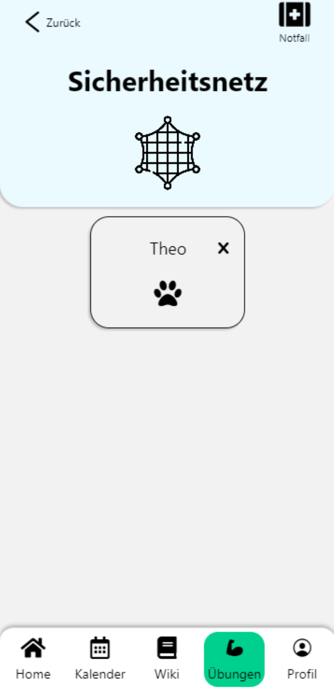

Zum Verändern eines Eintrags wird auf einen der Einträge im Kachellayout geklickt, woraufhin man durch dieselben Schritte wie bei der Erstellung eines Eintrages geleitet wird.
Hierbei sind die Daten aus dem bestehenden Eintrag schon in die zugehörigen Felder eingetragen.
Nach Beendigung wird überprüft, ob der Eintrag tatsächlich verändert wurde, und nur dann per PUT-Request an "/safetyNet/{id}" aktualisiert. Dadurch werden Verdopplungen von Einträgen vermieden.

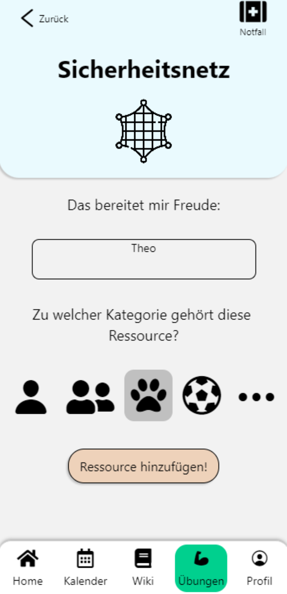

### Hürden bei der Implementierung

Bei der Erstellung der Kategoriewahl ist eine Diskrepanz zwischen der Vorgabe von Kopfsachen und den akzeptierten Kategorien der API aufgefallen.
Um dies zu lösen, wurden zunächst dazu in der Gruppe mögliche Alternativen besprochen.
Diese wurden darauf implementiert und in einer Pull-Request für die anderen Teams einsehbar gemacht.
Die Alternative in der Pull-Request wurde sowohl auf Github überprüft als auch im "ProgPrak"-Channel auf Mattermost besprochen. Nachdem die vorgeschlagenen Änderungen von mehreren Seiten akzeptiert wurden, konnte die Pull-Request gemerged werden.

## Markdown im Wiki

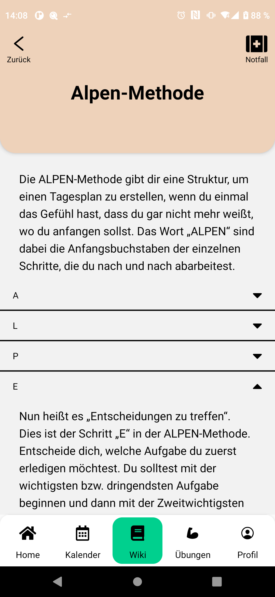

Das Wiki der Kopfsachen-App soll den Nutzer:innen eine Vielzahl von Informationen zu Themen der mentalen Gesundheit und Stressbewältigung liefern.

Jeder Artikel besitzt ID, Titel und Inhalt.
Erst wurde der Inhalt vom Backend-Team in einem eigenen JSON-Format, als Liste von Elementen wie z.B. Text oder Hyperlink, entworfen.
Da dieses Format einschränkend und schwer in seiner Quellform les- und verfassbar wäre, haben wir uns mit dem Backend-Team auf Markdown geeinigt.
Für Markdown gibt es bereits exzellentes Tooling für React Web [[3], [4]].
Auch für React Native gibt es Libraries [[5], [6]].
Wir haben uns für [react-native-markdown-display] entschieden.
Da der publizierte Stand jedoch nur React 16 unterstützt, mussten wir [einen Fork](https://github.com/jonasmerlin/react-native-markdown-display) verwenden, der das Projekt auf React 17 aktualisiert.

Leider enthält die Library `.js`-Dateien, die Gebrauch von JSX syntax machen. 
Die von Expo mitgelieferte Webpack-Konfiguration kann damit nicht umgehen, deshalb haben wie die Library [wiederum geforkt](https://github.com/ProgPrak-Native-App/react-native-markdown-display) und das JSX mithilfe von Babel zu reinem JS transpiliert.
So konnten wie die Library verwenden und Markdown in unserer App rendern.

### Akkordions

Manche Wiki-Artikel, wie der zur "ALPEN-Methode", sind recht lang.
Um einen besseren Überblick zu ermöglichen, wollten wir Artikel deshalb in Sektionen unterteilen und sie als einklappbare Akkordions darstellen.
(U.a. verwendet die mobile Ansicht von Wikipedia auch diese Strategie.)

Da das gleiche Markdown in den Web-Apps und auch in unserer mobilen App gerendert werden soll, können die Akkordions nicht fest im Markdown integriert werden.
Stattdessen müssen wir jeweils den Inhalt nach einer Level-2-Überschrift bis zur Nächsten automatisch in ein Akkordion zusammenfassen.
Um diese Idee zu implementieren, haben wir ein Plugin für react-native-markdown-display bzw. den zugrundeliegenden Parser markdown-it geschrieben, dass die Token-Liste des Markdowns anpasst.

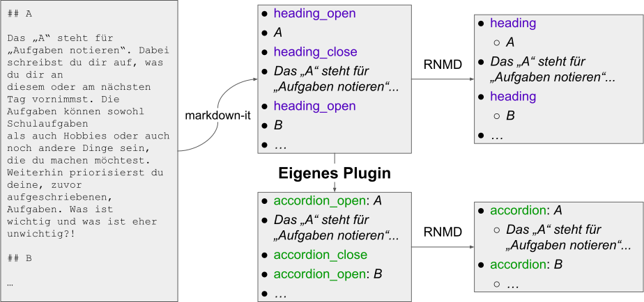

### Links auf andere Wiki-Artikel

In Markdown werden Links u.a. in der Syntax `[Link-Text](URI)` definiert.
Für Links auf Webseiten ist diese Syntax ohne weiteres von uns nutzbar, auf dem Gerät würde sich beim Tippen ein Webbrowser öffnen.
Allerdings soll auch von Wiki-Artikeln auf andere Wiki-Artikel verlinkt werden können.

Um das Antippen eines solchen Links in der App abzufangen und innerhalb der App zum korrekten Artikel zu navigieren, haben wir uns mit dem Backend-Team auf eine URI des Formats `kopfsachen:wiki/95zdf84rhfe84h` geeinigt, wobei der letzte Teil die ID des Artikels ist.
Aktuell ist dieses Feature noch nicht in der App implementiert und es gibt keine Artikel, die es nutzen, react-native-markdown-display [unterstützt die Implementierung aber gut](https://github.com/ProgPrak-Native-App/react-native-markdown-display#handling-links). 

[3]: https://github.com/remarkjs/react-markdown
[4]: https://npm.io/search/keyword:markdown
[5]: https://github.com/Benjamin-Dobell/react-native-markdown-view
[6]: https://github.com/CharlesMangwa/react-native-simple-markdown
[react-native-markdown-display]: https://github.com/iamacup/react-native-markdown-display

## Release

### GitHub

Recht früh haben wir GitHub Actions in unserem Projekt integriert. 
Als Teil unserer Pipeline wird unser Release Prozess automatisiert ausgeführt und ist dann in unseren [GitHub Releases] zu finden.
Seit Begin des Projekts haben wir insgesamt drei Releases veröffentlicht. 
Um unsere App lokal auszuprobieren, können hier entweder eine `.apk` für Android und eine`.app` für den iOS Simulator heruntergeladen werden.

### Expo Go

Im [README] ist außerdem der QR Code zu unerem neusten Release zu finden. 
Dieser kann einfach mit der [Expo Go] App gescannt werden um den Release lokal auszuführen.

## TODO

Entwickeln

- ~~E2E-Tests~~ :x:
- Authentifizierung :heavy_check_mark:
- QR-Code :heavy_check_mark:
- Polishen

Ideen generieren

- woran habe ich über das Semester gearbeitet? Was ist diskussionswürdig/ interessant?
- z.B. Zusammenarbeit untereinander/mit anderen Teams; Hürden/Dinge die gut gelaufen sind

Beispiele von Elias

- https://medium.com/swlh/how-to-write-a-technical-article-and-be-read-ccbecd30a66c
- https://medium.com/@weblab_tech/graphql-everything-you-need-to-know-58756ff253d8
- https://blogonyourown.com/tech-blogs

Slides:

- [Midterm slides]
- [Final slides]

[midterm slides]: https://docs.google.com/presentation/d/1NGj9W046PPFRzViuPo1Oqs9OgjPQGymZTuSad5sK_3A/edit
[final slides]: https://docs.google.com/presentation/d/1UYDbpvOzaAlohBbl47hufxIubeY6l2X04z7tfMnBxt0/edit
[NPM]: https://www.npmjs.com
[React Native]: https://reactnative.dev
[Flutter]: https://flutter.dev
[Expo]: https://expo.dev
[TypeScript]: https://www.typescriptlang.org
[ESLint]: https://eslint.org
[Prettier]: https://prettier.io
[Apple Developer Account]: https://developer.apple.com
[ZECM]: https://www.campusmanagement.tu-berlin.de/zecm/
[Xcode]: https://developer.apple.com/xcode/
[GitHub Releases]: https://github.com/ProgPrak-Native-App/react-native-app/releases
[README]: https://github.com/ProgPrak-Native-App/react-native-app/blob/develop/README.md
[Expo Go]: https://expo.dev/client
## Termine

> - Morgen (15.8.) wird kein Meeting stattfinden, obwohl es ein Montag ist
> - Am darauffolgenden Montag (22.8.) machen wir regulär ein Meeting, auch, wenn es vermutlich nicht super viel zu besprechen gibt
> - Ungefähr am 26.8. (Fr) - 29.8. (Mo) sollte die Entwicklung so ziemlich abgeschlossen sein. Dann setzen wir uns zusammen, um in der App nocheinmal alle Features durchzugehen, um etwaige Bugs und Ungereimtheiten zusammenzutragen
> - Am 5.9. (Montag vor der Abgabe) sollte sich der Report dem Ende nähern. Dann setzen wir uns nocheinmal zusammen, um alles durchzugehen.
> - Am 9.9. ist die Abgabe. Dazu schicken wir Elias einen Link zu einem (neuen) GitHub-Repo mit unserem Report als README.md.

###### tags: `uni`
